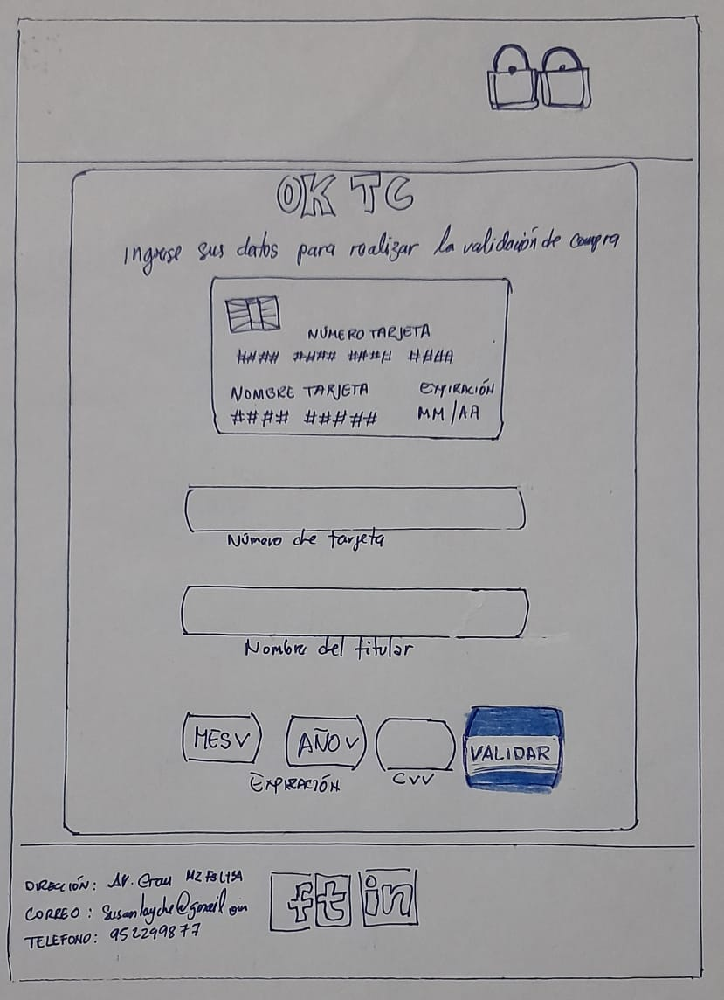

# Tarjeta de crédito válida: Ok TC

## Índice

- [1. Presentación](#1-Presentación)
- [2. Imagen del proyecto final](#2-Imagen-del-proyecto-final)
- [3. Investigación UX](#3-Investigación-UX)
- [4. Pistas, tips y lecturas complementarias](#4-pistas-tips-y-lecturas-complementarias)

---

## 1. Presentación

OK TC es una aplicación web que le permite al usuario validar el número de una tarjeta de crédito. Además, cuenta con la funcionalidad para ocultar todos los dígitos de una tarjeta menos los últimos cuatro.

## 2. Imagen del proyecto final

## 3. Investigación UX

1. Usuarios y los objetivos en relación con el producto.

   Los principales usuarios de OK TC son personas entre 18 y 80 años que cuenten con una tarjeta de crédito.

2. Solución del problema y necesidad del usuario.

   Debido al contexto Covid las compras online se han incrementado exponencialmente, es por ello que OK TC nace con la finalidad de mejorar la experiencia de compra de los usuarios, que por diversos factores tales como la falta de tiempo, evitar las aglomeraciones, el contacto con billetes y monedas deciden realizar una compra online con una tarjeta de crédito.

3. Foto del primer prototipo en papel / Baja fidelidad.

   

4. Feedback

   - Deysi me indicó que tenía que mover mi logo del body y que tenía que agregar una frase que haga referencia a lo que realizaremos en la aplicación web
   - Mis compañeras me ayudaron a que el botón "Validar" me funciene, pues estaba usuando onclick.
   - Mis compañeras me dieron pistas para realizar las función de Maskify.

5. Imagen del prototipo final

---

## 4. Pistas, tips y lecturas complementarias

### Primeros pasos

1. Antes que nada, asegúrate de tener un :pencil: editor de texto en
   condiciones, algo como [Atom](https://atom.io/) o
   [Code](https://code.visualstudio.com/).
2. Para ejecutar los comandos a continuación necesitarás una :shell:
   [UNIX Shell](https://curriculum.laboratoria.la/es/topics/shell),
   que es un programita que interpreta líneas de comando (command-line
   interpreter) así como tener [git](https://curriculum.laboratoria.la/es/topics/scm/01-git)
   instalado. Si usas un sistema operativo "UNIX-like", como GNU/Linux o MacOS,
   ya tienes una _shell_ (terminal) instalada por defecto (y probablemente `git`
   también). Si usas Windows puedes usar la versión completa de [Cmder](https://cmder.net/)
   que incluye [Git bash](https://git-scm.com/download/win) y si tienes Windows
   10 o superior puedes usar [Windows Subsystem for Linux](https://docs.microsoft.com/en-us/windows/wsl/install-win10).
3. Una de las integrantes del equipo debe realizar un :fork*and_knife:
   [fork](https://help.github.com/articles/fork-a-repo/) del repo de tu cohort,
   tus \_coaches* te compartirán un _link_ a un repo y te darán acceso de lectura
   en ese repo. La otra integrante del equipo deber hacer un fork **del
   repositorio de su compañera** y
   [configurar](https://gist.github.com/BCasal/026e4c7f5c71418485c1) un `remote`
   hacia el mismo.
4. :arrow*down: [Clona](https://help.github.com/articles/cloning-a-repository/)
   tu \_fork* a tu computadora (copia local).
5. 📦 Instala las dependencias del proyecto con el comando `npm install`. Esto
   asume que has instalado [Node.js](https://nodejs.org/) (que incluye [npm](https://docs.npmjs.com/)).
6. Si todo ha ido bien, deberías poder ejecutar las :traffic_light:
   pruebas unitarias (unit tests) con el comando `npm test`.
7. Para ver la interfaz de tu programa en el navegador, usa el comando
   `npm start` para arrancar el servidor web y dirígete a
   `http://localhost:5000` en tu navegador.
8. A codear se ha dicho!
